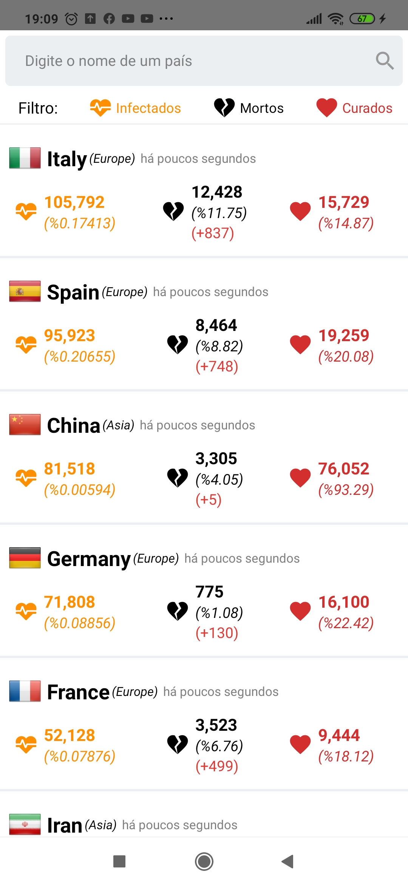

<h1 align="center">
    
</h1>

<h4 align="center"> 
 🚀 App Status Covid 19 (new Coronavirus) in the World
</h4>

  

  
	
  

  

  

  

  <a href="#-project">Project</a>&nbsp;&nbsp;&nbsp;|&nbsp;&nbsp;&nbsp;
  <a href="#rocket-Technologies">Technologies</a>&nbsp;&nbsp;&nbsp;|&nbsp;&nbsp;&nbsp;
  <a href="#-layout">Layout</a>&nbsp;&nbsp;&nbsp;|&nbsp;&nbsp;&nbsp;
  <a href="#-how-to-contribute">How to contribute</a>&nbsp;&nbsp;&nbsp;|&nbsp;&nbsp;&nbsp;
  <a href="#memo-license">License</a>

## 💻 Project

Experimental mobile application for tracking status of COVID-19 pandemic.

This application uses [REST Countries v1](https://rapidapi.com/apilayernet/api/rest-countries-v1/details), [COVID-19](https://api-sports.io/documentation/covid-19) API's from [Rapid API](https://rapidapi.com) and creates data statistics with simple visuality for user.

It's created for just experimental. You can fork and work with it however you want.

<h1 align="center">
    
</h1>

## :rocket: Technologies

This project was developed with the following technologies:

- [React Native](https://facebook.github.io/react-native/)

## 💻 Screens

|              ●              |              ●              |              ●              |
| :-------------------------: | :-------------------------: | :-------------------------: |
|  |  |  |

## How to Run

- Make a fork && clone
- Inside of the root folder run:
  - `npm install` or `yarn`
  - `cd ios && pod install && cd ..`
  - `npx react-native run-ios` (macOS users) or `npx react-native run-android`
  - Start to play!

## 🤔 How to contribute

- Make a fork;
- Create a branck with your feature: `git checkout -b my-feature`;
- Commit changes: `git commit -m 'feat: My new feature'`;
- Make a push to your branch: `git push origin my-feature`.

After merging your receipt request to done, you can delete a branch from yours.

## :memo: License

This project is under the MIT license. See the [LICENSE](LICENSE.md) for details.

---

Made with ♥ by Thiago Marinho :wave: [Get in touch!](https://www.linkedin.com/in/tgmarinho/)

# Previews Version made by [ezranbayantemur](https://github.com/ezranbayantemur/covid-19-app)

|             ●              |             ●              |             ●              |
| :------------------------: | :------------------------: | :------------------------: |
|  |  |  |

|             ●              |             ●              |
| :------------------------: | :------------------------: |
|  |  |

Thank you for inspiration!
